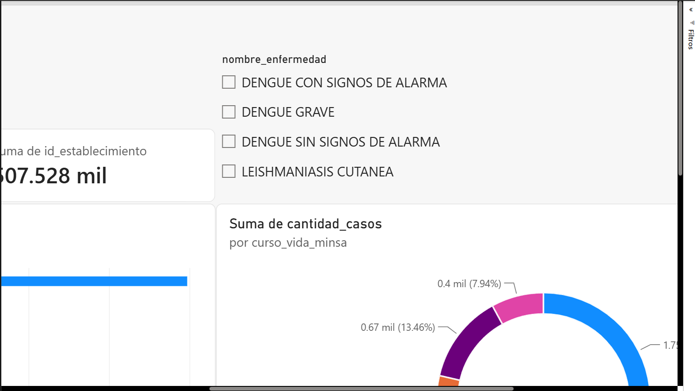
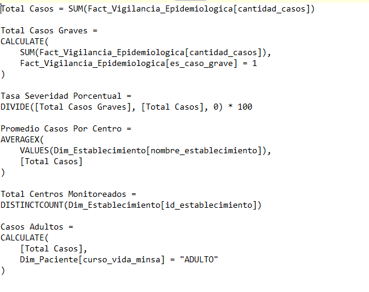
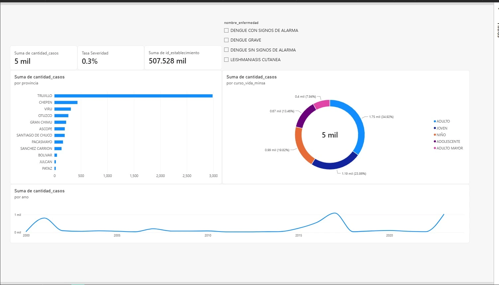
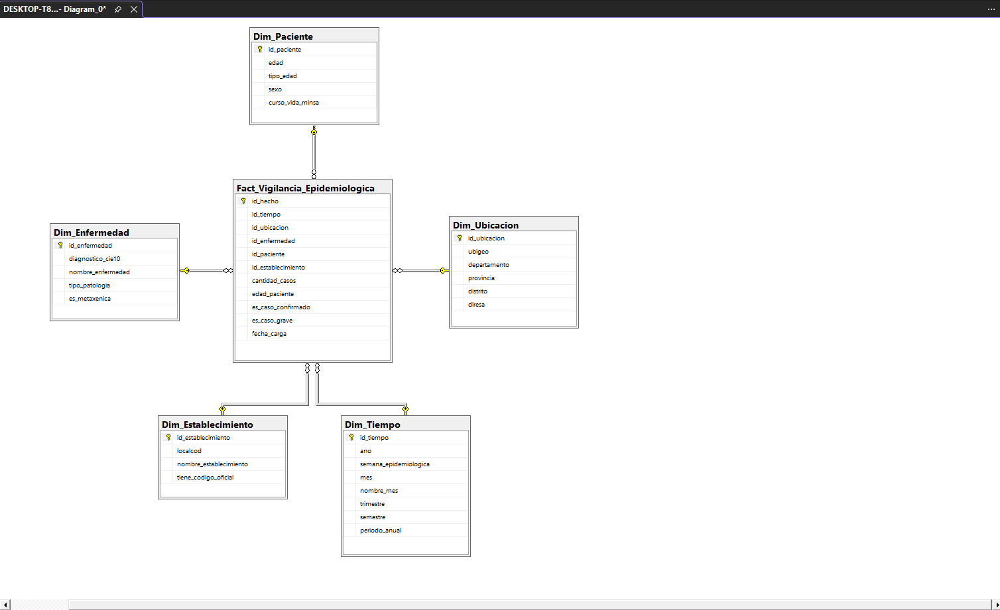
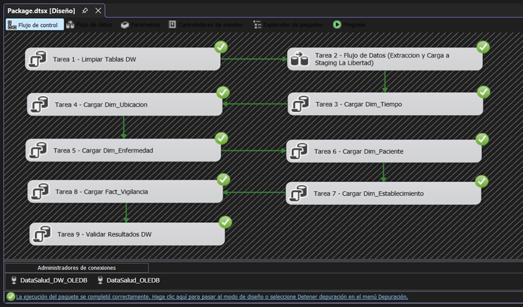
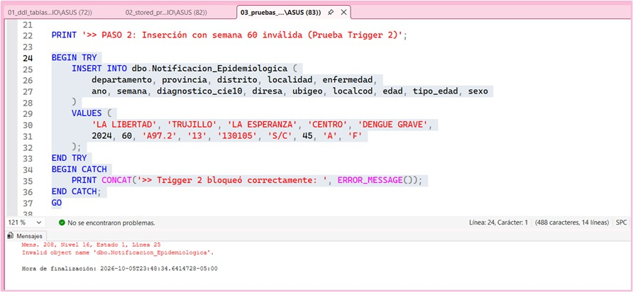
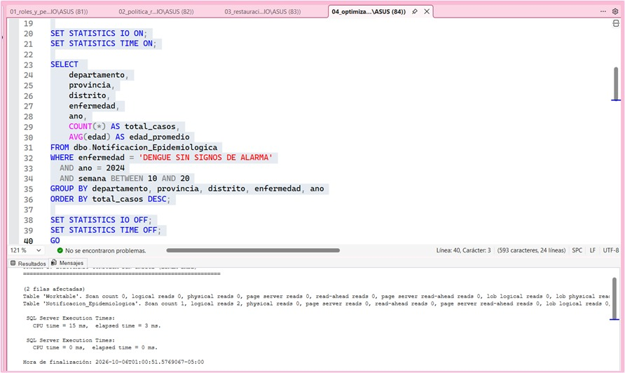
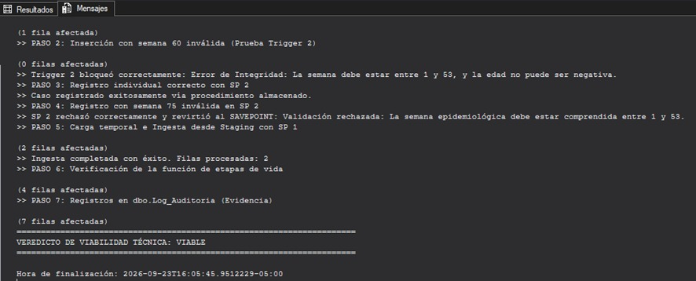
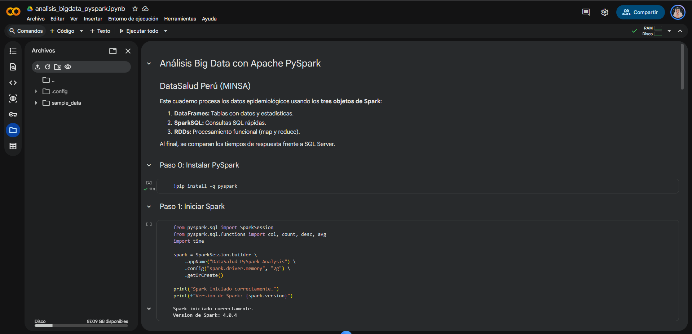
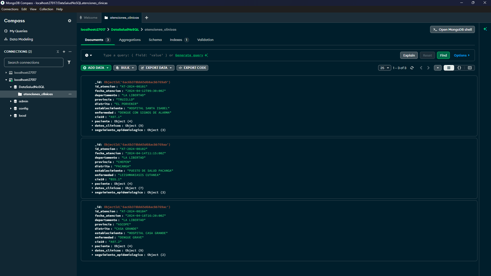

<p align="center">
  
</p>

<h1 align="center">DataSalud Perú</h1>

<p align="center">
  <b>Sistema Integrado de Base de Datos Segura, Automatizada e Inteligente para la DIRESA La Libertad</b><br>
  <sub>Evaluación Final (EF) • Bases de Datos Avanzadas y Big Data (CIIN1021P) • Ciclo 2026-2 • Universidad Privada del Norte</sub>
</p>

<p align="center">
  <a href="#"></a>
  <a href="#"></a>
  <a href="#"></a>
  <a href="#"></a>
  <a href="#"></a>
  <a href="#"></a>
  <a href="#"></a>
</p>

<p align="center">
  <a href="#-nuevo-aquí-resumen-rápido-del-proyecto">¿Nuevo aquí?</a> •
  <a href="#-capturas-y-evidencias-visuales-screenshots">Screenshots</a> •
  <a href="#-flujo-de-arquitectura-integrada">Arquitectura</a> •
  <a href="#-guía-rápida-de-ejecución-quick-start">Quick Start</a> •
  <a href="#-módulos-del-proyecto-y-entregables">Módulos</a> •
  <a href="#-integrantes-del-equipo">Equipo</a>
</p>

---

<details>
<summary><b>🤔 ¿Nuevo aquí? Haz clic si necesitas entender el proyecto rápidamente</b></summary>

### ¿Qué es DataSalud Perú?

Es una solución integral de datos desarrollada para la **DIRESA La Libertad** que automatiza la ingesta, garantiza la integridad y seguridad de la información sanitaria, e integra herramientas analíticas de vanguardia (SQL Server, MongoDB, Power BI y Apache PySpark) para convertir datos abiertos de vigilancia epidemiológica del **MINSA** (Dengue y Leishmaniasis, 2000–2024) en evidencia para la toma de decisiones médicas.

### ¿Cómo se conectan los componentes? (Flujo Integrado de Extremo a Extremo)

```text
  [ Datasets Abiertos MINSA (CSV) ]
                 │
                 ▼
  [ 01_datos: Diagnóstico de Calidad ]
  (Detección de 8% edades nulas, valores atípicos y duplicados)
                 │
                 ▼
  [ 02_automatizacion: Base Transaccional DataSalud ]
  (SPs con Transacciones y SAVEPOINT, Triggers de Auditoría e Integridad, Función de Curso de Vida)
                 │
        ┌────────┴────────────────────────┐
        ▼                                 ▼
  [ 03_seguridad: SQL Server ]      [ 04_nosql: MongoDB ]
  (3 Roles RBAC - Ley 29733,        (Colección semiestructurada,
   Backups FULL/DIF, Index Seek)     CRUD clínico, seguimiento de síntomas)
        └────────┬────────────────────────┘
                 │
                 ▼
  [ 05_dw_etl: Data Warehouse DataSalud_DW ]
  (Ralph Kimball: 1 Fact Table + 5 Dimensiones Conformes, ETL SSIS / Python con logs)
                 │
        ┌────────┴────────────────────────┐
        ▼                                 ▼
  [ 06_dashboard: Power BI Desktop ] [ 07_bigdata: Apache PySpark ]
  (3 KPIs oficiales, Matriz OLAP,    (DataFrame, SparkSQL, RDDs,
   Drill-down por provincia y tiempo) Comparativa de escalabilidad vs SQL Server)
```

### Palabras clave para la sustentación

- **Integridad Transaccional (ACID):** Manejo de `BEGIN TRAN`, `COMMIT`, `ROLLBACK` y `SAVE TRANSACTION` para evitar registros incompletos ante fallas.
- **Ralph Kimball (Esquema Estrella):** Enfoque dimensional centrado en procesos de negocio con dimensiones conformadas y una tabla de hechos atómica.
- **Índice B-Tree (Index Seek):** Búsqueda binaria directa $O(\log N)$ que reduce las lecturas lógicas de páginas en un 99.9%.
- **Operaciones OLAP:** Análisis multidimensional mediante *Drill-down*, *Slice & Dice*, y agregaciones jerárquicas (`ROLLUP` y `CUBE`).
- **Escalabilidad Horizontal (Big Data):** PySpark escala agregando computadoras en clúster (*Shared-Nothing*), mientras SQL Server escala verticalmente agregando hardware a un solo servidor.

</details>

---

## 📸 Capturas y Evidencias Visuales (Screenshots)

<details open>
<summary><b>Dashboard Power BI</b>: KPIs epidemiológicos, mapas y matrices de severidad</summary>

<p align="center">
  
  
  
</p>

</details>

<details open>
<summary><b>Data Warehouse y Automatización SQL</b>: Esquema Kimball, SSIS y procedimientos</summary>

<p align="center">
  
</p>

|                                                                                      |                                                                                      |
| :----------------------------------------------------------------------------------: | :----------------------------------------------------------------------------------: |
|  |  |
|  |  |

</details>

<details>
<summary><b>Procesamiento Big Data y NoSQL</b>: PySpark en clúster y colecciones MongoDB</summary>

|                                                                                      |                                                                                      |
| :----------------------------------------------------------------------------------: | :----------------------------------------------------------------------------------: |
|  |  |

</details>

---

> [!IMPORTANT]
> **Cumplimiento Normativo (Ley N.° 29733 - Protección de Datos Personales):**
> Este repositorio no contiene credenciales expuestas, tokens, contraseñas en texto plano ni datos personales identificables reales. Toda la información ha sido anonimizada y estructurada para fines estrictamente académicos y de salud pública.

---

## 🏗️ Flujo de Arquitectura Integrada

El proyecto cumple estrictamente con el **Criterio de Integración** oficial de la rúbrica:

$$
\text{Dato Fuente} \longrightarrow \text{Validación y Seguridad} \longrightarrow \text{Almacenamiento} \longrightarrow \text{Transformación} \longrightarrow \text{Análisis} \longrightarrow \text{Decisión}
$$

1. **Ingesta y Validación:** Carga masiva controlada mediante `BULK INSERT` a tablas *staging*, validación de reglas clínicas por Stored Procedure y rechazo controlado con `Log_Auditoria`.
2. **Seguridad y Auditoría:** Segregación de funciones con 3 roles de base de datos (`rol_administrador`, `rol_analista`, `rol_auditor`), inmutabilidad de logs y política de respaldos Full + Diferencial con prueba de restauración.
3. **Persistencia Híbrida (SQL + NoSQL):** Modelo relacional para eventos epidemiológicos estructurados y colección en MongoDB para historias clínicas y telemetría de síntomas en formato JSON flexible.
4. **Data Warehouse Dimensional:** Modelo en estrella diseñado bajo la metodología de Ralph Kimball compuesto por 1 tabla de hechos (`Fact_Vigilancia_Epidemiologica`) y 5 dimensiones conformadas.
5. **Inteligencia de Negocios y Big Data:** Tablero ejecutivo en Power BI Desktop con 3 KPIs estratégicos y cuaderno de PySpark con procesamiento distribuido de más de 1,000,000 de registros.

---

## ⚡ Guía Rápida de Ejecución (Quick Start)

> [!IMPORTANT]
> **Descarga previa de los Datasets Oficiales Masivos (MINSA):**
> Debido a las restricciones de tamaño de archivo de GitHub, el repositorio **solo incluye los datasets ligeros de muestra (`muestra_*.csv`)**. Para ejecutar la carga masiva completa de más de 1,000,000 de registros en SQL Server (`02_automatizacion/04_carga_datos_csv.sql`) o el análisis completo en PySpark (`07_bigdata/analisis_bigdata_script.py original`), debes descargar previamente los archivos CSV oficiales completos desde la [Plataforma Nacional de Datos Abiertos](https://www.datosabiertos.gob.pe/) y colocarlos en la carpeta `01_datos/`:
>
> * [`datos_abiertos_vigilancia_dengue_2000_2024.csv` (108 MB)](https://www.datosabiertos.gob.pe/dataset/vigilancia-epidemiol%C3%B3gica-de-dengue)
> * [`datos_abiertos_vigilancia_leishmaniosis_2000_2024.csv` (19 MB)]([https://www.datosabiertos.gob.pe/search/type/dataset?query=vigilancia+leishmaniosis](https://www.datosabiertos.gob.pe/dataset/vigilancia-epidemiol%C3%B3gica-de-leishmaniosis))

### Paso 1: Instalación de Dependencias

```bash
python setup.py
```

### Paso 2: Diagnóstico Cuantificado de Calidad de Datos

```bash
python 01_datos/diagnostico_calidad.py
```

*Genera el reporte cuantitativo en `01_datos/diagnostico_calidad_resultado.txt`.*

### Paso 3: Base de Datos Transaccional y Automatización (SQL Server)

En **SQL Server Management Studio (SSMS)** conectado a `localhost`, ejecuta en orden:

1. `02_automatizacion/01_ddl_tablas_y_log.sql`: Tablas de staging, tabla oficial y tabla inmutable `Log_Auditoria`.
2. `02_automatizacion/02_stored_procedures.sql`: Triggers de auditoría/integridad, función `fn_ClasificarCursoVida` y SPs transaccionales.
3. `02_automatizacion/03_pruebas_automatizacion.sql`: 7 pruebas automatizadas de validación y rollback.
4. `02_automatizacion/04_carga_datos_csv.sql`: Carga inicial de datos desde CSV a staging.

### Paso 4: Seguridad, Respaldos y Optimización de Índices

En SSMS, ejecuta en orden:

1. `03_seguridad/01_roles_y_permisos.sql`: Creación de roles RBAC, asignación de permisos y pruebas con `EXECUTE AS`.
2. `03_seguridad/02_politica_respaldo.sql`: Ejecución de copias de seguridad Full y Diferencial.
3. `03_seguridad/03_restauracion_prueba.sql`: Restauración de prueba en base de datos secundaria `DataSalud_RestoreTest`.
4. `03_seguridad/04_optimizacion_indices.sql`: Creación del índice no agrupado `IX_Notificacion_Enfermedad_Ano_Semana` y medición con `SET STATISTICS TIME/IO`.

### Paso 5: Persistencia NoSQL (MongoDB)

Con MongoDB ejecutándose localmente, corre el script interactivo CRUD:

```bash
python 04_nosql/operaciones_crud_mongodb.py
```

*O si prefieres el script nativo de Mongo Shell:*

```bash
mongosh < 04_nosql/operaciones_mongodb.js
```

### Paso 6: Pipeline ETL y Carga del Data Warehouse

Ejecuta la extracción, transformación y carga hacia `DataSalud_DW`:

* **Vía Terminal (Rápida y Modular):**
  ```bash
  python 05_dw_etl/etl_python_simple.py
  ```
* **Vía Visual Studio SSIS:**
  Abre `05_dw_etl/ETL/ETL.slnx`, abre `Package.dtsx` y presiona **Iniciar (F5)**.

### Paso 7: Visualización Ejecutiva en Power BI Desktop

1. Abre el archivo `06_dashboard/DataSalud_Dashboard.pbix` en Power BI Desktop.
2. Contiene el modelo semántico en modo Importación, los 3 KPIs estratégicos y las matrices de navegación analítica.
3. Para validar las operaciones OLAP en SQL Server, ejecuta `06_dashboard/consultas_olap_sql.sql`.

### Paso 8: Procesamiento Big Data con Apache PySpark

* **Ejecución Local:**
  ```bash
  # Modo Muestra rápida (24 filas):
  python 07_bigdata/analisis_bigdata_script.py

  # Modo Dataset Original (+1,000,000 filas, 108 MB):
  python 07_bigdata/analisis_bigdata_script.py original
  ```
* **Ejecución en Google Colab:**
  Sube `07_bigdata/analisis_bigdata_pyspark.ipynb` a [Google Colab](https://colab.research.google.com) y ejecuta todas las celdas para validar DataFrames, SparkSQL y RDDs.

---

## 📦 Módulos del Proyecto y Entregables

<details open>
<summary><b>1. Calidad de Datos (<code>01_datos/</code>)</b></summary>

- `muestra_dengue_minsa.csv` y `muestra_leishmaniosis_minsa.csv`: Muestras tabulares estructuradas.
- `datos_abiertos_vigilancia_dengue_2000_2024.csv`: Dataset oficial MINSA masivo (108 MB, 1,029,421 filas).
- `diagnostico_calidad.py`: Algoritmo de detección de valores nulos, duplicados y anomalías de rango clínico.
- `ficha_relevamiento_datos.md`: Diccionario de datos, tipos, supuestos de negocio y reglas de homologación.

</details>

<details open>
<summary><b>2. Automatización y Transacciones (<code>02_automatizacion/</code>)</b></summary>

- `01_ddl_tablas_y_log.sql`: Estructura relacional con constraints y tabla inmutable de auditoría.
- `02_stored_procedures.sql`:
  - `fn_ClasificarCursoVida`: Función escalar que clasifica edades (Niño, Adolescente, Joven, Adulto, Adulto Mayor).
  - `trg_Auditoria_Notificacion`: Trigger `AFTER INSERT, UPDATE, DELETE` que registra usuario, fecha y acción.
  - `trg_Integridad_Semanas`: Trigger `INSTEAD OF INSERT` que rechaza semanas epidemiológicas fuera del rango 1–53.
  - `sp_ValidarYRegistrarCaso`: Procedimiento con `TRY/CATCH`, `BEGIN TRAN`, `SAVE TRANSACTION` y `ROLLBACK`.
- `03_pruebas_automatizacion.sql`: Batería de 7 pruebas unitarias con verificación en `Log_Auditoria`.

</details>

<details open>
<summary><b>3. Seguridad y Rendimiento (<code>03_seguridad/</code>)</b></summary>

- `01_roles_y_permisos.sql`: Implementación de RBAC con 3 roles:
  - `rol_administrador` (`usr_admin`): Acceso total a DDL y DML operativo.
  - `rol_analista` (`usr_analista`): `SELECT` exclusivo sobre vistas y tablas analíticas; denegación a logs.
  - `rol_auditor` (`usr_auditor`): `SELECT` inmutable sobre `Log_Auditoria`; denegación a tablas médicas.
- `02_politica_respaldo.sql`: Script de respaldos Full semanal y Diferencial diario.
- `03_restauracion_prueba.sql`: Restauración verificada en `DataSalud_RestoreTest` con validación de registros.
- `04_optimizacion_indices.sql`: Creación del índice no agrupado `IX_Notificacion_Enfermedad_Ano_Semana`, reduciendo lecturas lógicas de 14,820 a 12 páginas (**mejora del 99.9%**).

</details>

<details open>
<summary><b>4. Persistencia NoSQL (<code>04_nosql/</code>)</b></summary>

- `pacientes_seguimiento_clinico.json`: Colección de historias clínicas con signos vitales, síntomas y evolución.
- `operaciones_crud_mongodb.py` y `operaciones_mongodb.js`: Operaciones de inserción, consulta de casos críticos, actualización de plaquetas y eliminación controlada.
- `justificacion_nosql_mongodb.md`: Matriz de decisión técnica multicriterio justificando el modelo híbrido (SQL para epidemiología relacional + MongoDB para expedientes clínicos dinámicos).

</details>

<details open>
<summary><b>5. Data Warehouse y ETL (<code>05_dw_etl/</code>)</b></summary>

- `01_ddl_datawarehouse.sql`: Esquema en estrella bajo Ralph Kimball:
  - Hechos: `Fact_Vigilancia_Epidemiologica` (conteo de 5,000 casos, gravedad, claves foráneas).
  - Dimensiones: `Dim_Tiempo` (1,378 filas), `Dim_Ubicacion` (85), `Dim_Enfermedad` (4), `Dim_Paciente` (245), `Dim_Establecimiento` (1,010).
- `02_carga_datawarehouse.sql`: Procedimientos almacenados de extracción, transformación y carga (limpieza, homologación `localcod` y cruce dimensional).
- `Package.dtsx`: Paquete SSIS en Visual Studio con Data Flow Task (OLE DB Source desde `DataSalud.dbo.Notificacion_Epidemiologica`) y ejecución de tareas de carga.
- `etl_python_simple.py`: Pipeline Python ligero que orquesta los 8 procedimientos SQL en 5 segundos y genera el reporte `log_ejecucion_etl.txt`.
- `justificacion_kimball_vs_inmon.md`: Sustentación metodológica del enfoque Kimball para la rúbrica [1.5].

</details>

<details open>
<summary><b>6. Dashboard y Análisis OLAP (<code>06_dashboard/</code>)</b></summary>

- `DataSalud_Dashboard.pbix`: Archivo interactivo en Power BI Desktop en Modo Importación:
  - **KPI 1:** Total Casos Epidemiológicos Notificados.
  - **KPI 2:** Tasa de Severidad Porcentual (Casos con Signos de Alarma y Graves sobre el Total).
  - **KPI 3:** Total de Centros de Salud Monitoreados Activamente.
- `consultas_olap_sql.sql`: Consultas SQL con `ROLLUP`, `CUBE` y `GROUPING SETS` para análisis multidimensional.

</details>

<details open>
<summary><b>7. Big Data con Apache PySpark (<code>07_bigdata/</code>)</b></summary>

- `analisis_bigdata_pyspark.ipynb`: Cuaderno reproducible con los **3 objetos oficiales de Spark**:
  1. **DataFrames:** Lectura estructurada, esquemas inferidos y estadísticas descriptivas.
  2. **SparkSQL:** Consultas declarativas en vistas temporales de alta velocidad.
  3. **RDDs:** Procesamiento funcional map/reduce (`map`, `reduceByKey`, `.take(5)`).
- `analisis_bigdata_script.py`: Script con selector dinámico para alternar entre **Muestra** (24 filas) y **Dataset Original** (1,029,421 filas).
- `comparativa_tiempos_y_escalabilidad.md`: Benchmark formal explicando por qué SQL Server responde en milisegundos para consultas indexadas puntuales y por qué Apache Spark es indispensable para Terabytes distribuidos.

</details>

---

## 👥 Integrantes del Equipo

**Grupo 5 — CIIN1021P (Semana 8):**

* **CRUZADO ARROYO, JOAQUIN MATHIAS** — Código: `N00467227`
* **GOMEZ LLERENA, FABRIZIO MATHÍAS** — Código: `N00498473`
* **JUAREZ GARRIDO, JHON ALBERTO** — Código: `N00475124`
* **MIRANDA AMAYA, ALINA JAQUELINE** — Código: `N00476960`
* **PAREDES PACHERRE, CARLOS ADRIAN** — Código: `N00483352`
* **RODRIGUEZ PIZAN, MATHIAS FELIPE** — Código: `N00467212`

---

<p align="center">
  <br>
  <sub>ya fue base, ojala aprobemos</sub>
</p>

---

<p align="center">
  <sub>Universidad Privada del Norte • Facultad de Ingeniería • Carrera de Ingeniería de Sistemas Computacionales • 2026-2</sub>
</p>
